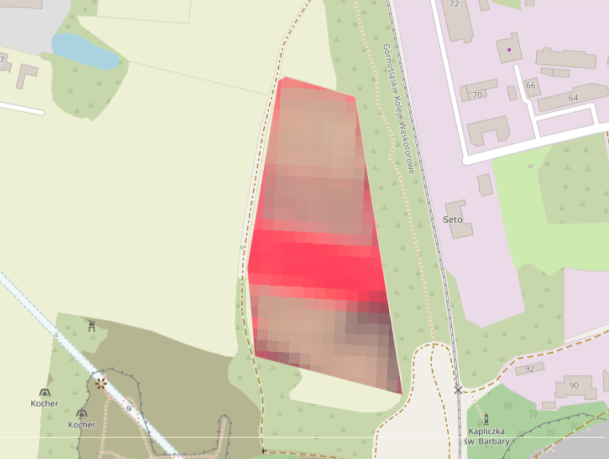

# False Color Visualization

False Color Composites (e.g. NIR-Red-Green) enhance vegetation visibility and help distinguish land cover types.

### Common Combinations:
- **NIR–Red–Green:** Healthy vegetation = bright red
- **SWIR–NIR–Red:** Moisture detection

Visualization using:
Blue -> Red
Green -> Green
Red -> Blue

Highlights vegetation (bright red) and reveals bare areas (brown/gray).

The source of the background is the OpenStreetMap Contributors.

These tools enhance interpretability in remote sensing workflows.
