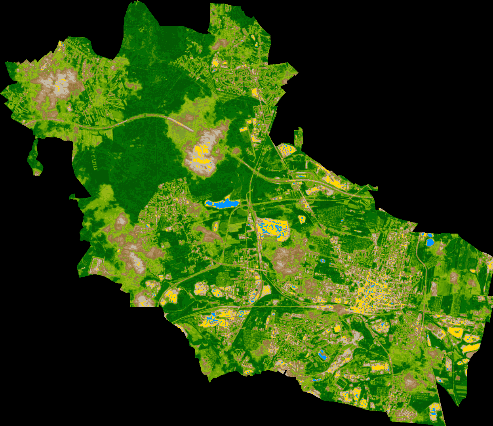

# NDVI (Normalized Difference Vegetation Index) 
is a measure of how "green" or healthy vegetation is. It helps distinguish between bare soil and plant -covered areas by analyzing how much light plants reflect in the red and near-infrared parts of the spectrum.

There is an example of Normalized Difference Vegetation Index above.
